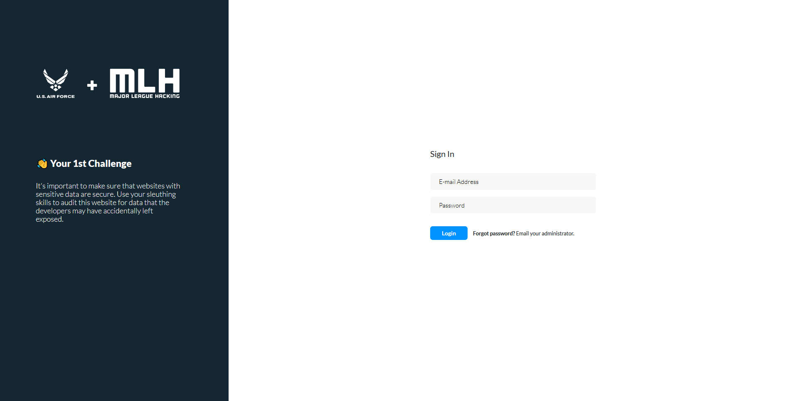

# **U.S. Air Force Major League Hacking CTF**
##**Challenge 1:**

Challenge begins with a login page.

Text provided to us hints to the existence of a file left by the developer.
> It's important to make sure that websites with sensitive data are secure. Use your sleuthing skills to audit this website for data that the developers may have accidentally left exposed.

I began by exploring the **robot.txt** file to see if there are any hidden pages that were not indexed by search engines.

A simple python script was used to analyze the robots.txt file:

```
def robots_parser():
    url = 'https://mlh-ctf-usaf-01.herokuapp.com/robots.txt'
    response = requests.get(url)
    soup = BeautifulSoup(response.text, 'html.parser')
    print(soup)
```

Results indicated a few locations:


_*note: URLs are randomly generated for each session._

That allowed me to navigate to the page and revealed a hidden flag.


